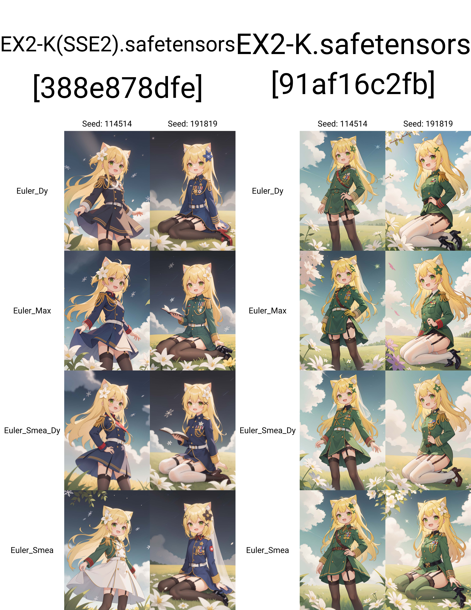

# advance_eular_sampler_extension
## 目录
- [advance\_eular\_sampler\_extension](#advance_eular_sampler_extension)
  - [目录](#目录)
  - [介绍](#介绍)
  - [效果展示](#效果展示)
  - [安装](#安装)
    - [通过命令安装](#通过命令安装)
    - [通过 stable-diffusion-webui 安装](#通过-stable-diffusion-webui-安装)
    - [通过绘世启动器安装](#通过绘世启动器安装)
  - [使用](#使用)
  - [鸣谢](#鸣谢)


## 介绍
一个为 [stable-diffusion-webui](https://github.com/AUTOMATIC1111/stable-diffusion-webui) 添加 Eular Smea 采样算法的扩展

采样器源码：[Euler-Smea-Dyn-Sampler](https://github.com/Koishi-Star/Euler-Smea-Dyn-Sampler)、[Pyramid_Noise_For_Inference](https://github.com/Koishi-Star/Pyramid_Noise_For_Inference)

## 效果展示
以下是使用 [EX2-K](https://civitai.com/models/161977/ex2-k) 模型进行测试的结果：  
  
推荐搭配该模型进行使用，下载地址：[EX2-K - SSE2 | Stable Diffusion Checkpoint | Civitai](https://civitai.com/models/161977/ex2-k)

## 安装
### 通过命令安装

进入 stable-diffusion-webui 的 extensions 目录
```bash
cd extensions
```
使用 Git 命令下载该扩展
```bash
git clone https://github.com/licyk/advanced_euler_sampler_extension
```

### 通过 stable-diffusion-webui 安装
进入 stable-diffusion-webui 界面后，点击`扩展`->`从网址安装`，将下方的链接填入`扩展的 git 仓库网址`输入框
```
https://github.com/licyk/advanced_euler_sampler_extension
```
点击`安装`下载该扩展

### 通过绘世启动器安装
打开绘世启动器，点击`版本管理`->`安装新扩展`，在下方的`扩展 URL`输入框填入下方的链接
```
https://github.com/licyk/advanced_euler_sampler_extension
```
点击输入框右侧的`安装`下载该扩展

## 使用
扩展安装完成后，可在 stable-diffusion-webui 生图选项卡的`采样方法`中看到 Eular Smea 采样算法，选中后即可使用

## 鸣谢
[Koishi-Star](https://github.com/Koishi-Star)：提供 Eular Smea 采样算法
[ananosleep](https://github.com/ananosleep)：提供为 SD WebUI 添加采样算法的方法